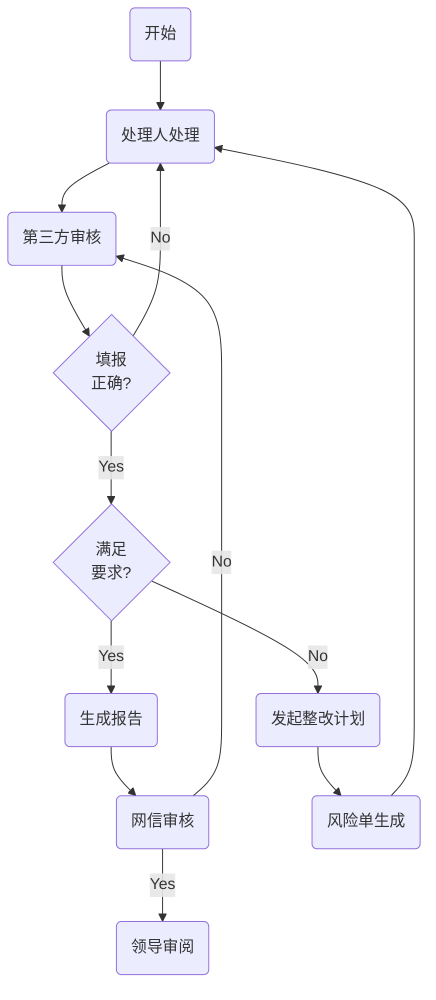
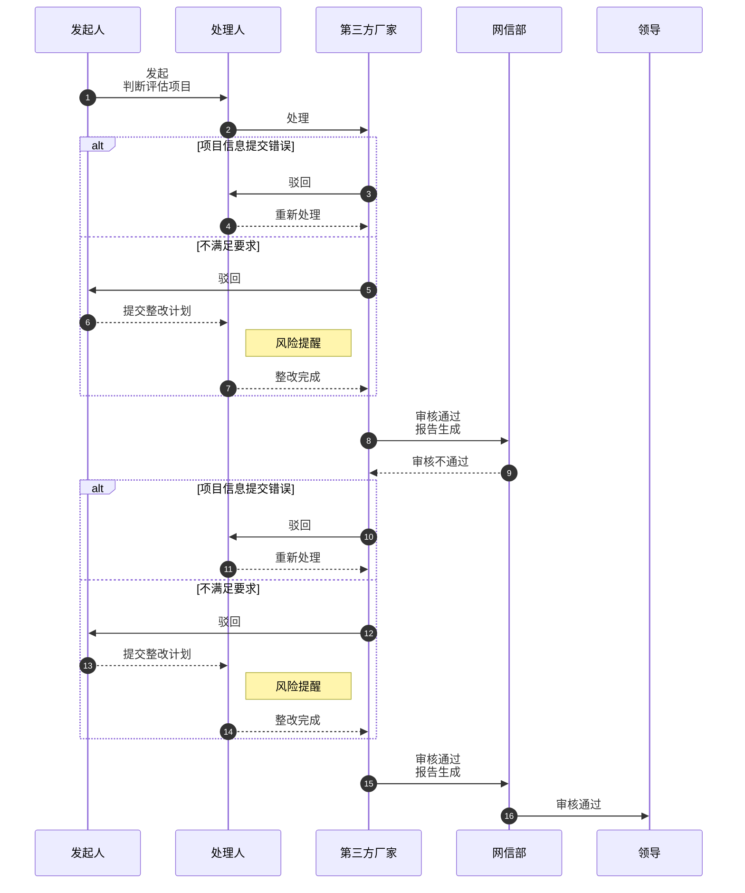
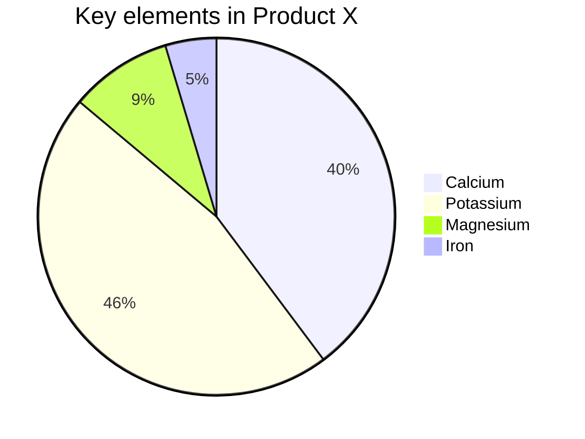
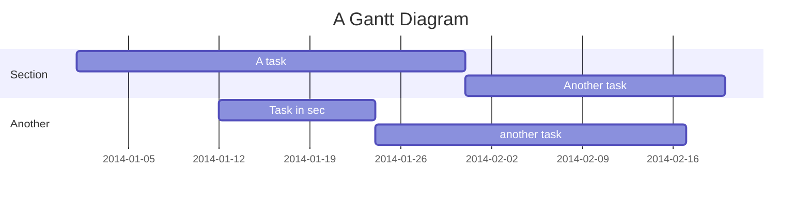

# graph

```mermaid
graph TB
start(开始)
handle(处理人处理)
reject("第三方审核")
approve("网信审核")
error{"填报<br>正确?"}
conform{"满足<br>要求?"}
leader("领导审阅")
plan("发起整改计划")
risknotify("风险单生成")
report("生成报告")
start --> handle --> reject
reject --> error --> |Yes| conform --> |Yes| report -->approve
error --> |No| handle
conform --> |No|plan --> risknotify --> handle
approve --> |Yes|leader
approve --> |No| reject

```

# sequenceDiagram

```mermaid
sequenceDiagram
autonumber
participant S as 发起人
participant H as 处理人
participant T as 第三方厂家
participant W as 网信部
participant E as 领导

S ->> H:发起<br>判断评估项目
H ->> T:处理
alt 项目信息提交错误
T ->> H:驳回
H -->> T: 重新处理
else 不满足要求
T ->> S: 驳回
S -->> H: 提交整改计划
Note right of H:风险提醒
H -->> T: 整改完成
end
T ->> W: 审核通过<br>报告生成
W -->> T: 审核不通过
alt 项目信息提交错误
T ->> H:驳回
H -->> T: 重新处理
else 不满足要求
T ->> S: 驳回
S -->> H: 提交整改计划
Note right of H:风险提醒
H -->> T: 整改完成
end
T ->> W: 审核通过<br>报告生成
W ->> E: 审核通过

```

# pie

```mermaid
pie
    title Key elements in Product X
    "Calcium" : 42.96
    "Potassium" : 50.05
    "Magnesium" : 10.01
    "Iron" :  5
```
# gantt

```mermaid
gantt
    title A Gantt Diagram
    dateFormat  YYYY-MM-DD
    section Section
    A task           :a1, 2014-01-01, 30d
    Another task     :after a1  , 20d
    section Another
    Task in sec      :2014-01-12  , 12d
    another task      : 24d
```

